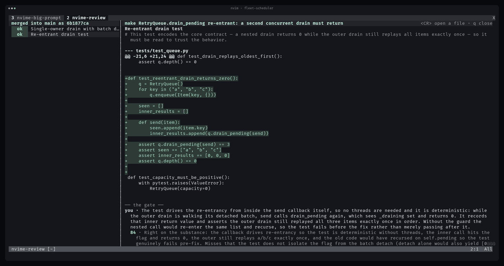
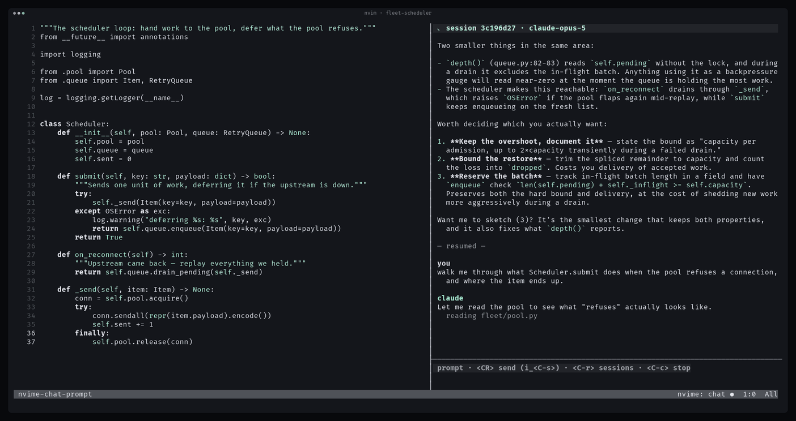
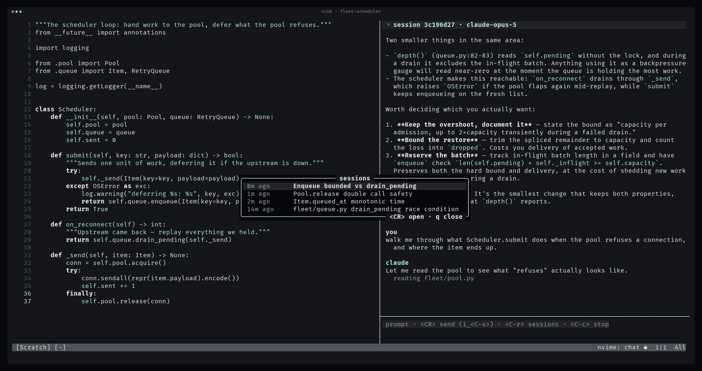
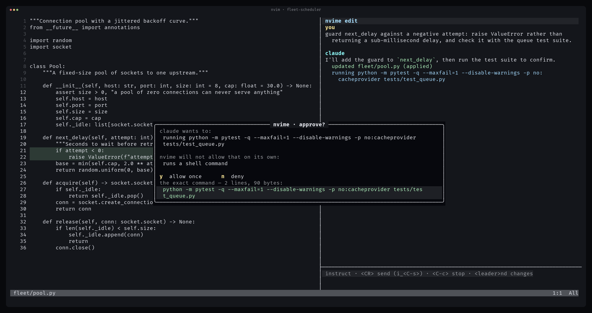
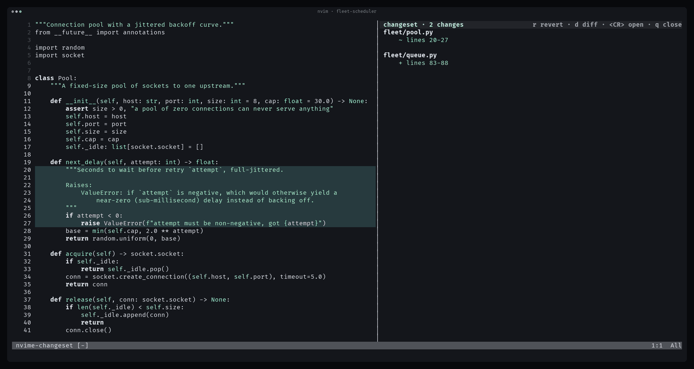
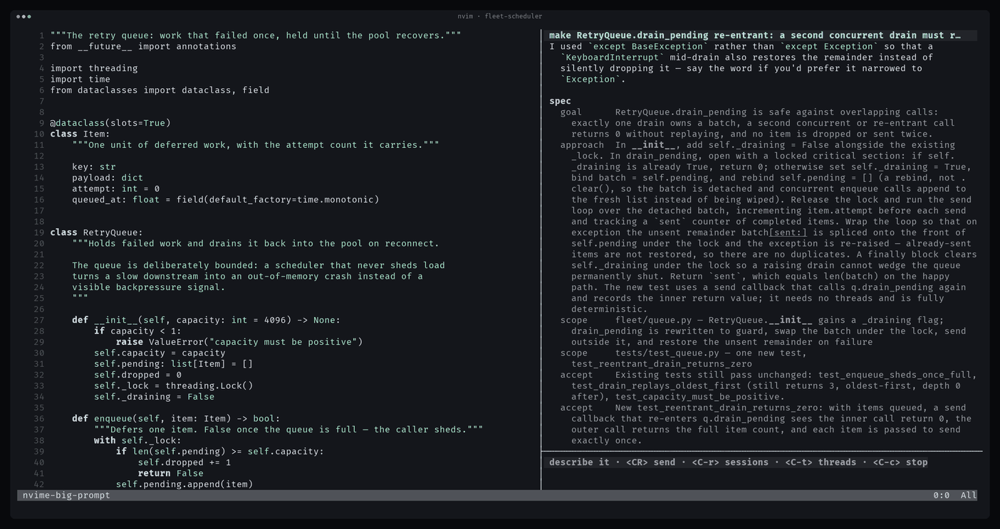
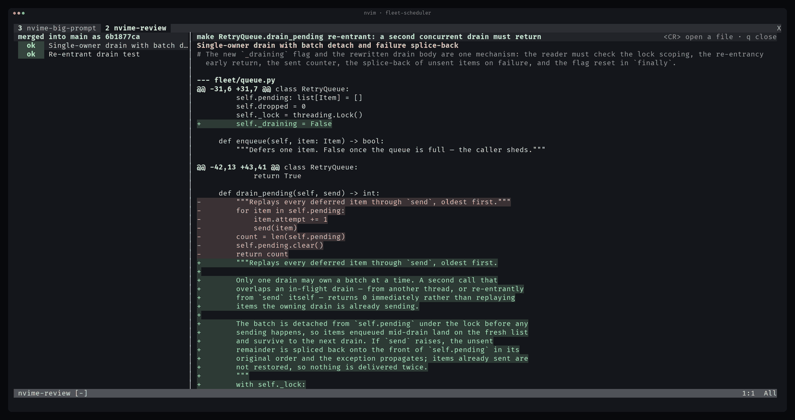
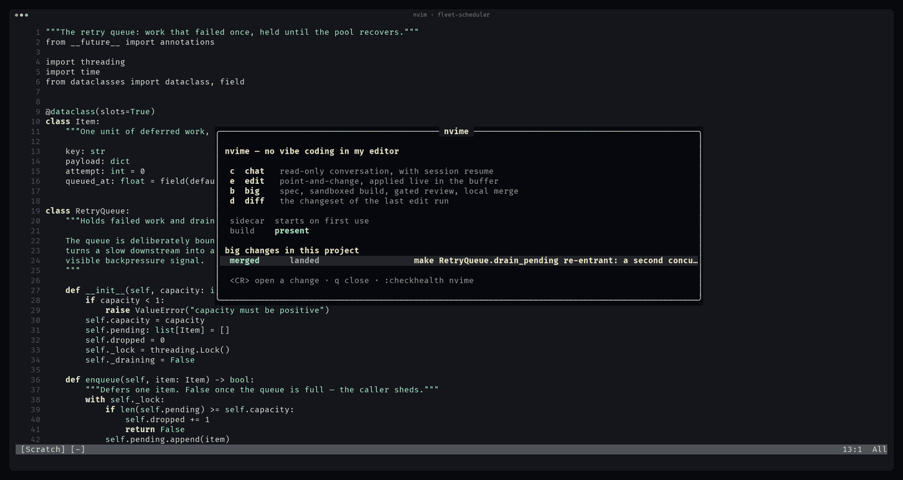
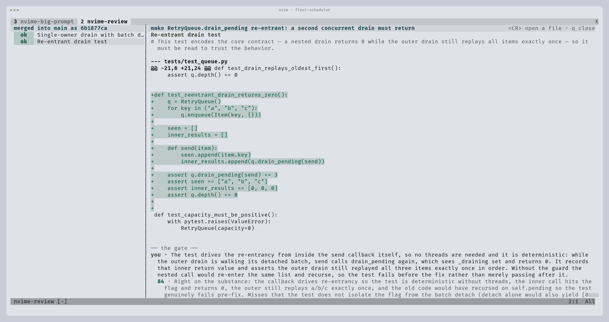
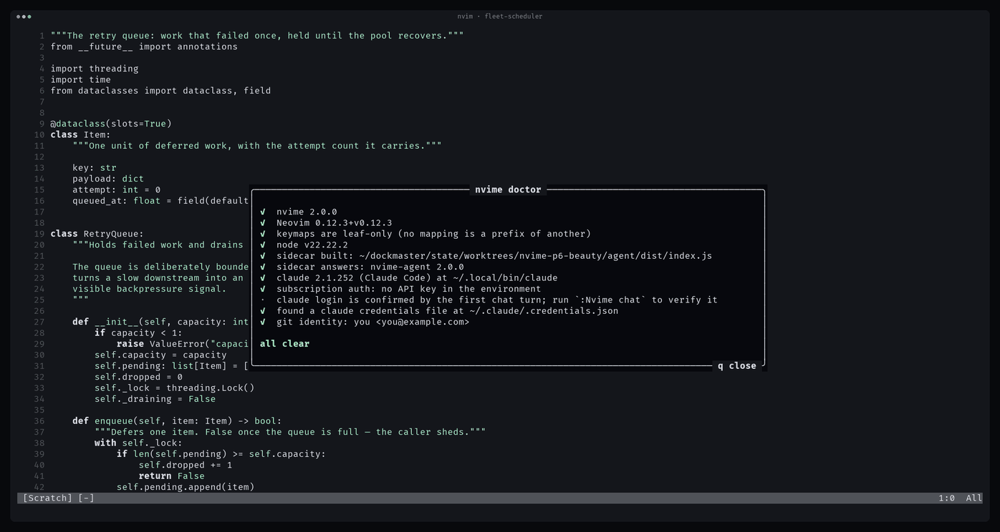

# nvime

**No vibe coding in my editor.**

nvime is a Claude-native Neovim plugin with an opinion: an agent may write your
code, but you do not get to merge what you cannot explain. Chat and point-and-
change work the way you would expect. The third mode — Big Change — sends Claude
off to build in a disposable clone of your repository, splits the result into
review threads, and then **grades your defense of each one** before it will land
anything on your branch. There is no force-merge.



Lua is the UI. A small Node sidecar owns every conversation through the
[Claude Agent SDK](https://www.npmjs.com/package/@anthropic-ai/claude-agent-sdk)
and drives your local `claude` install with your existing subscription login.
No API key, in any code path.

---

## Requirements

- Neovim >= 0.10
- Node >= 20
- Claude Code installed and signed in (`claude` on `PATH`)

## Install

lazy.nvim:

```lua
{
  'devGunnin/nvime',
  build = 'npm --prefix agent install && npm --prefix agent run build',
  opts = {
    keymaps = { enabled = true },
  },
}
```

`opts` is passed to `require('nvime').setup()`. The build step compiles the
sidecar to `agent/dist/index.js`; the plugin runs that file with `node`.

## Quickstart

```
:Nvime doctor      -- everything wired up?
:Nvime enroll      -- public workstation record for an administrator
:Nvime chat        -- ask something about the repo
:Nvime edit        -- change the file you are in
:Nvime big         -- describe a change worth reviewing
:Nvime             -- the dashboard: where every big change is
```

Nothing is claimed until you use it: the sidecar starts on the first request,
and nvime binds no global key until `keymaps.enabled = true`.

---

## Chat

`<leader>nc` — a fresh, read-only conversation with resumable session history.



Streaming markdown, rendered as it arrives: headings, fenced code on its own
ground, inline code, the tool calls the model is making. nvime classifies every
line itself and paints nothing else over it, so a line never changes colour
between streaming and settled, and `**bold**`, `` `code` `` and `~~struck~~`
read as what they mean rather than as their own punctuation. A `---` separator
becomes a short gap marker, not a rule across the panel.

**A question with alternatives becomes a list you pick from.** When the model's
question is a choice rather than an open one, it offers the alternatives and the
panel renders them numbered, inline in the conversation:

```
  Which configuration mechanism should greet.py use?
  1  CLI flag
     Add argparse so `greet.py --greeting hi` sets the text; no new files.
  2  Environment variable
     Read GREET_MESSAGE via os.environ with a default; no argument parsing.
  3  Config file
     Most flexible, but adds I/O, a file format and error handling.
  1-3 picks · ]o returns here · o for something else
```

Press the digit and it answers, echoing your pick into the transcript as
`→ 2: Environment variable` — but only while your cursor sits on the block's
own rows; anywhere else in the scrollback a digit is the ordinary vim count it
always is, so a count like `12G` still lands on line 12 rather than being
swallowed as a pick. `]o` jumps the cursor onto the pending choice from
wherever you are, prompt included. Some questions take several answers at
once; those toggle, and `<CR>` sends them, scoped the same way. `o` — or just
typing in the prompt — answers in your own words instead, and typing the
number works too. The digit, `<CR>` and `o` keys are buffer-local to the panel
and released the moment you answer.

**Context is deliberate.** Write `@path/to/file` or `@path/to/dir` in a prompt
and nvime attaches it — a file as its contents, a directory as a bounded
listing. Relative paths resolve against the project root the panel was opened
on, not Neovim's cwd. Bad, binary or oversized paths are reported in the panel,
never silently dropped. `<leader>ns` sends a visual selection with its file and
line range.

**Fresh by default, resumable by choice.** Opening chat starts a new
conversation, so yesterday's context cannot silently leak into today's task —
this is `chat.default = 'new'`; set it to `'resume-last'` to pick this
project's most recent conversation back up on open instead. Either way,
`<C-r>` opens a picker whose first row is "new conversation" and whose
remaining rows are past sessions by title and age — a session with no prompt
yet reads as `(new)` plus its short id, so two of them are still tellable
apart. `d` on a row deletes that session and its history, after a y/n float,
never a modal. `<C-n>` clears the surface for another new conversation without
deleting history. Resume survives Neovim restarts, and several Neovim
instances share the session file without overwriting each other. A running turn
must be stopped before switching or deleting, so its stream and cancellation
handle cannot be orphaned.



**Chat cannot touch your code.** It gets `Read`, `Glob`, `Grep`, `WebFetch` and
`WebSearch`; file mutation and shell are denied through SDK options, not prompt
text.

---

## Edit

`<leader>ne` — you point, it changes, and you watch it happen.



From normal mode the instruction is scoped to the current file; from visual
mode, to the selection. The prompt stays armed afterwards, and a follow-up is
deliberately *not* pinned to the original file, so "now do the same for the
other queue" works.

**Live application.** Every file the agent changes is pushed to the editor as
its exact before/after the moment the tool finishes. If a buffer holds that
file, only the changed hunks are rewritten through the buffer API: your cursor
and scroll position stay put, the changed lines light up and fade after ~1.5s,
and the buffer is left unmodified and in step with disk — no `:e`, no reload
prompt, no W11/W12 later. "Stay put" means the *line you were on*, not the line
number: a hunk inserted above you moves your cursor down with your own content.
A file nothing has open is simply current when you next open it; the panel says
it changed.

**One undo block per run, per buffer.** A single `u` reverts everything one run
did to that buffer. Honestly: `u` reverts the *buffer*. Disk keeps the agent's
version until you `:w` the reverted buffer.

**Your unsaved work is never clobbered.** If the buffer holds edits the agent
did not see, nvime refuses to touch it and reports a conflict instead. The
change is still on disk and still in the changeset — review and revert it from
`<leader>nd`, or save/discard your edits and re-run.

**Nor is anyone else's write.** Before reconciling a buffer nvime re-reads the
file and requires it to still hold one of the two sides of the change. If a
formatter, a `git checkout`, or a second editor got there in between, nvime
reports `external-change` and writes nothing — the newer content survives, and
the stale mtime is left in place so `:checktime` still warns you.

**Trust is scoped, and the ask shows you everything.** Writes under the project
root run unattended. A write anywhere else, and any shell command, stops and
asks — a float with `y`/`n`, never a modal, and the editor stays usable while it
waits. The float carries the **whole** command or path, wrapped over as many
lines as it takes; the one-line summary in the panel is clipped, the thing you
are authorizing is not. Past 8 KB it says `!! TRUNCATED` and how many bytes it
could not show. An unanswered ask is denied, as is one whose run you cancelled.
The wrap counts display cells, not characters or bytes, so a wide-character
summary or a tab-laden command cannot push the command itself off the float —
it is sized to what it actually shows, not to a line count that assumed one
character is one column.

Paths are resolved one component at a time, the way the kernel resolves them, so
a `..` that follows a symlink out of the project climbs out of the link's target
and is asked about — it does not collapse back to a path that looks like it is
inside the root. The ask names where the write really lands whenever that
differs from the path the agent typed.

**A shell step is not silent.** An approved `Bash` call can change files nvime
has no before/after for. When one finishes, nvime reconciles the buffers under
the root with disk: clean ones are brought up to date (and said to be *not* in
the changeset, because they are not), and every other one is named with the
reason rather than touched.

**The changeset.** `<leader>nd` lists every file the run touched with its hunks.



`<CR>` jumps to a hunk, `d` toggles a plain unified diff, and `r` reverts one
hunk through the same live-application path — in either view, on any `+` or `-`
line. A hunk whose lines you have since hand-edited refuses to revert rather
than writing something neither side asked for; a hunk that only moved still
reverts correctly. Files the agent created are recorded but not revertible.

---

## Big Change

`<leader>nB` — the flagship. Claude interrogates the request until the spec is
real, builds it alone in a clone, then makes *you* pass review.

### Intake

Describe the change; Claude reads the repo and asks until it is not guessing,
then plays back a spec — goal, approach, scope, acceptance criteria, and what is
deliberately out of scope.



The spec comes back as schema-enforced structured output, so nvime never scrapes
it out of prose; if the turn answers with something unusable, the prose is shown
as the next question and **no spec is invented**, because a fabricated spec is
one you would approve without noticing. Answer, revise, or type `approve`.

**Starting fresh never costs you an existing change.** Opening the panel
starts a new change, and `<C-r>`'s picker leads with "start a new change" —
existing sessions and their clones are kept until you explicitly `discard`
one. `<C-n>` starts another new change from inside the panel the same way.

### Build

Approving records the repo's HEAD and returns immediately; the build then makes
a **local clone** of your repository at that commit, HEAD detached, under
`stdpath('data')/nvime/big/<repo>/<session>/wt`. A clone rather than a worktree:
a worktree's `.git` points into *your* repository, and the build runs shell
unattended. `--local` hardlinks the object database, so the clone costs a
checkout and almost no disk, and its `origin` remote is removed. The build agent
works there with full mutation rights, runs whatever tests the project has, and
is told not to commit. Progress streams into the panel; `<C-c>` stops it.

The build does not run inside Neovim's sidecar. It runs in a **detached runner
process** of its own, which holds the session's claim, owns the build's agent
session, and appends every event — deltas, tool lines, phase changes, steers,
the result — to an append-only `events.ndjson` beside the session record.
**Close the laptop and the build carries on.** Capture and triage run in the
runner too, so a build you walked away from ends with its threads ready rather
than with a diff nobody sorted.

Open the session again — the same Neovim, a new one, two at once — and the panel
**attaches**: it replays the log from where it left off, then follows the runner
live over a unix socket in `$XDG_RUNTIME_DIR/nvime`. Several viewers are fine.
`<C-c>` stops the build through that socket (the runner writes its terminal
event and releases its claim). Only if the socket will not answer is the
recorded pid signalled, and only once the session's claim has proved that pid is
still this build's runner — a killed runner leaves its pid on the record on
purpose, and pids get reused. Where that proof fails, nvime says the build had
already died rather than signalling something else. That proof still has one
narrow window: a runner's claim is trusted live for 15s past its last
heartbeat, so a pid recycled by the OS *inside* that 15s would still read as
"this build's runner" and get signalled — recycling a pid that fast means
wrapping the OS's pid space, not a realistic risk on a default Linux
`pid_max`.

A runner claims the session **before** it opens the log or binds the socket, so
one session's `events.ndjson` has exactly one writer: a second runner exits
without recording a byte. The log is replayed from its tail rather than in
full, and an attach that starts after older events says how many it skipped.

If the runner cannot be started at all, the build falls back into the sidecar
**with a notice saying so** — never silently, because then it really would stop
with your editor. `NVIME_DETACHED=0` forces that older behaviour. Windows is a
documented non-goal: the control channel is a unix domain socket.

**Who can reach a running build.** The socket's directory is `0700` and the
socket itself `0600`, so the channel is reachable by processes running as you
and nobody else — and *anything* running as you includes the build agent's own
Bash. Every control frame must therefore also carry a per-run token that lives
only in the session record (also `0600`). That raises the bar from "any process
you run" to "any process that can read your nvime store"; it is not a boundary
against yourself. A steer is recorded with the editor that sent it, and a
viewer renders someone else's as `another editor → build`, never as your own.

### Steering

`s` in the build panel opens a compose box. What you type is handed to the
running build as an ordinary user turn — "use the existing retry helper", "also
add a `--help` flag" — and the agent reads it at its next turn boundary. Nothing
is interrupted and nothing is re-run.

Mechanism, measured rather than assumed: the SDK's **streaming input mode**. The
runner drives the build turn from an async iterable of user messages instead of
one prompt string, so a message handed over mid-turn either gets folded into the
turn already running or runs as its own turn straight after it. Both are
normal, and both are visible: the stream shows `you → build` when a steer is
accepted and again when the agent takes it.

A steer is **context, and only context**. It goes through the same `query()`
whose options were fixed when the build started, so it cannot widen the write
boundary, reach the permission callback, or touch the review gate. What it
changes still arrives as hunks you have to read.

### Triage

On completion nvime runs `git add -A -N` (so files the build created are
diffable without a commit) and captures `git diff <base>`. A read-only triage
turn groups the hunks into threads and rates each substantial or trivial.
**Every hunk lands in exactly one thread**: unknown ids are dropped, a hunk
claimed twice goes to its first claimant, and anything triage forgot becomes an
open `unsorted` thread. If the triage turn fails or answers with garbage, it
falls back to one substantial thread per file and says so — the hunks are never
dropped.

Trivia auto-resolves but stays in the list with an `auto` chip, and `X` re-opens
it, so you always know everything that changed.

### The review pane is the file

Selecting a thread opens the build clone's own copy of the changed file as an
**ordinary buffer** — real path, real filetype, treesitter highlighting, and
your own LSP attaching exactly as it would to a file you opened yourself, so
`gd` and diagnostics work while you review. It is `nomodifiable` and
`readonly` — the clone is a sandbox to read, not to edit — and that holds for
every buffer the pane shows, a file you already had open included. Such a
buffer stays yours: the review borrows it, then hands it back listed and
writable exactly as you had it, while the buffers the review opened itself are
wiped when it closes.

Because `M`, `R` and `t` are ordinary motions on a page of code, `M` (merge)
and `R` (rebase) ask a y/n question first when you press them on the file. On
the thread list, which is not a code surface, they stay immediate.

The diff is drawn *over* that buffer as extmarks, never as text, so the bytes
stay the file's and nothing downstream is reading a rendering. Changed and added
rows carry a band, removed lines render as dim virtual lines above whatever
replaced them, and the thread's question and its graded rounds hang at its first
hunk. `]c` / `[c` walk the thread's hunks and switch file when a thread spans
more than one.

`t` toggles the plain unified diff, which is still there for pure patch reading.
A thread with nothing to annotate — binary content, a deleted file — falls back
to it on its own, and so does a build clone that has been cleaned up, which says
so once. So does a file that has moved on since the capture: one line per hunk
is checked against the buffer before anything is drawn, because a band on the
wrong row reads exactly like a band on the right one. A hunk that offers no such
line — a pure deletion between blank lines — cannot be checked, so it is not
drawn either. A file you already have open in another tab falls back too: the
review leaves that window alone, says where the file is, and `<CR>` goes there.

### The gate

`a` on an open substantial thread opens an answer box and asks what the change
does and why. **Paste is blocked**: the put mappings refuse with a reason,
`vim.paste` — what bracketed paste from the terminal calls — is refused while
the box is open, and anything that gets past both, `:put` and a register put
included, is undone by a watcher on the buffer itself, which sees every change
whatever made it. The watcher counts *characters*, not bytes, so a CJK or IME
typist can type an answer at all.

It is a paste block, not a sandbox, and this README will not pretend otherwise.
The watcher catches a *burst*, so text fed in slowly enough gets through. There
is nothing worth having on the other side of that: the grader grades the answer
you submit, so defeating the block buys a low score and another round.

Submitting runs one read-only grading turn, in the build clone so the grader can
check a claim against the code, resumed across rounds so a follow-up remembers
what it already asked. It grades understanding, not eloquence: an answer that
restates the diff, or that would fit any change of that shape, scores low.

| difficulty | pass mark |
|---|---|
| `vibe` | no gate — substantial threads arrive cleared |
| `easy` | 40 |
| `medium` | 70 (default) |
| `extreme` | 90 |

Set it in `setup()`, or type the word in the panel while the spec is still being
drafted. It is fixed at approval: moving the bar afterwards would re-rate a
review that has already happened.

Under the mark the thread stays open and the grader's hint and follow-up render
in it; the next answer has to address the follow-up. There is no round cap and
no override — `X` refuses to clear a substantial thread by hand. If the grading
turn fails or answers unusably, the round is recorded **ungraded**: your answer
is kept, the thread stays open, and the pane says why. A grade nobody gave is
never inferred.

If triage rates **every** thread trivial, an all-trivia change gets one more
thread, open: *everything was rated trivial — open the diff and confirm*. It
holds no hunks, so it hides nothing, and it carries no signature, so every
re-capture asks again. No setting removes it.

### The merge

`M` lands the reviewed change on the branch the build started from — the only
thing nvime ever writes to your repository.



It asserts every precondition itself rather than trusting the screen, and
reports *all* of them at once: threads still open, a diff that no longer
verifies, a binary change, a base branch that moved or went away, a checkout on
some other branch, tracked changes in your tree.

The mechanics are one-way. The commit is built entirely in a private index file
outside the repository — `read-tree` the base, `git apply --cached` (with a
`--3way` fallback), `write-tree`, `commit-tree` — so an interruption at any point
before the end leaves your index, tree and branches byte for byte as they were.
Then the branch `nvime/big/<slug>` is created at that commit with an atomic
create-only `update-ref`, and exactly one command touches your checkout:
`git merge --ff-only`.

`git merge` moves whatever HEAD points at, not the branch you name it, so HEAD
itself is re-read immediately before that command — the ref it is **on** and the
commit it is **at** — and again after. A `git checkout -b side` made between the
precondition check and the merge stops it, rather than fast-forwarding the
reviewed change onto some other ref of yours.

If anything fails, the branch is deleted again and the rollback is *verified*
against the repository as this attempt found it. Once the commit is on your
branch nothing can un-land it, so nothing after that point is reported as a
failed merge: if the record write then fails you are told the change **landed**
and could not be recorded. The commit message is the session title, authored
with your own git identity and nothing else.

Afterwards open buffers are refreshed through the same conflict-aware path edit
mode uses. The session is `merged`, which is terminal. The build clone is kept
until you discard it (`big.cleanup_on_merge = true` drops it instead).

If the base branch has moved, `R` rebases the build onto it: the clone fetches
the new base, git moves the work, and a build turn resolves whatever conflicted
and re-runs the tests. Content you already defended carries forward by
signature; anything the move changed comes back open.

That rebase is an agent turn, so it takes as long as one. Anything the review
tab runs for more than a moment shows a spinner on the left bar naming what is
running, and the right bar carries the last thing the run reported doing —
`Edit lua/nvime/big.lua`, `re-verifying on the new base`. A second keystroke
while one is in flight says what it is waiting on rather than sending a request
the sidecar would only refuse.

Unlike the panel's `<C-c>` (which reaches the runner and actually stops the
turn), `<C-c>` in the review tab only gives up **locally** — the review tab has
no cancel channel a grading round can reach, so the run keeps going on the
sidecar and may still land. Giving up just frees the tab to send the next
request rather than refuse it as busy.

### State honesty

Every transition is recorded with its timestamp, and the record is reconciled
against the disk on every read. A build whose runner is still going comes back
as `building (detached — keeps running)`, and attaches. A runner that was
**killed** leaves its claim stale and its identity on the record, and that
combination — a runner named, nothing behind it — is what reads as `build died
— resumable`, with `resume` and `discard` as its exits. Neither is ever
reported as "built". If the clone is gone the session drops back to
`drafting` with the spec intact; if the captured diff is gone it drops back to
`triaging`, whose exit is `retriage`. Nothing claims a review is ready without a
diff to review.

The captured diff and the threads describing it are written as ONE record, and
each hunk's id is a hash of its own content — so a run that dies between the two
leaves a session with no threads rather than one build's threads rendered over
another build's hunks.

The store is shared by every Neovim you have open, so a run claims its session
with a heartbeating lock file. A second editor shows `building (in another
editor)`; if the sidecar holding it dies, the claim goes stale and the session
becomes a normal detached one again. A detached runner holds that same claim,
and the pid on the record is what tells the two apart — one is a build to
attach to, the other is somebody else's session to leave alone.

---

## The dashboard

`:Nvime` with no argument: what nvime can do, whether it is wired up, and every
big change in this project with its review progress. `<CR>` opens one.



---

## Commands

| | |
|---|---|
| `:Nvime` | the dashboard |
| `:Nvime chat` | open the chat panel |
| `:Nvime edit` | instruct claude about the current file |
| `:Nvime big` | start a big change (`<C-r>` resumes one) |
| `:Nvime diff` | review the changeset |
| `:Nvime cancel` | stop whichever run is going |
| `:Nvime model` | pick a lane and its model/effort override |
| `:Nvime enroll` | show and copy this workstation's public enrollment record |
| `:Nvime doctor` | the preflight, as one pass/warn/fail list |
| `:Nvime health` | the same checks in `:checkhealth` |
| `:Nvime statusline` | toggle the built-in winbar status |
| `:Nvime debug [on\|off\|toggle\|info\|debug]` | the debug log's level for this session |
| `:Nvime log [clear]` | show the debug log's tail, or empty it |
| `:Nvime bundle` | write everything a bug report needs to one file |
| `:checkhealth nvime` | node, claude, sidecar, keymaps |

## Keymaps

Off until `keymaps.enabled = true`.

| key | where | |
|---|---|---|
| `<leader>nc` | normal | open chat |
| `<leader>ns` | visual | send the selection with its file and line range |
| `<leader>ne` | normal | instruct claude about this file |
| `<leader>ne` | visual | instruct claude about the selection |
| `<leader>nd` | normal | review the changeset |
| `<leader>nB` | normal | open a big change |
| `<CR>` | prompt, normal | send |
| `<C-s>` | prompt, insert | send (so `<CR>` still inserts a newline) |
| `<C-c>` | chat / edit / big prompt, both modes | stop the running turn (in insert it acts without leaving insert) |
| `<C-r>` | chat / big prompt | list past conversations or changes — in insert only while the box is empty, so `i_CTRL-R` stays the register paste |
| `<C-n>` | chat panel, normal | new conversation (insert keeps `i_CTRL-N` for the `@`-path popup) |
| `<CR>` / `d` / `q` | session picker | open · delete (y/n confirm) · close |
| `]o` | chat/big panel | jump to the pending choice |
| `q` | scrollback | close |
| `y` / `n` / `<Esc>` | approval float | allow once / deny / deny |
| `<Esc>` | compose float, both modes | cancel on one press — the draft goes to the unnamed register, `"p` pastes it back |
| `<CR>` / `r` / `d` | changeset | open the file · revert the hunk · unified diff |
| `<C-n>` / `<C-r>` / `<C-t>` | big panel | new change · resume one · open the review threads |
| `]t` / `[t` | review | next · previous thread |
| `]c` / `[c` / `t` | review | next · previous hunk in the thread · toggle the unified diff |
| `a` / `e` / `r` | review | defend this thread · explain a cleared one · request changes |
| `X` / `R` / `M` | review | re-open a trivial thread · rebase onto a moved base · merge (`R`/`M` confirm on the file pane) |
| `<C-c>` | review | give up waiting on a wedged request — does not stop it, unlike the panel's `<C-c>` |
| `<CR>` | review | open this file in the build clone |
| `c` `e` `b` `d` / `<CR>` | dashboard | chat · edit · big · changeset / open the change under the cursor |

Every mapping is a leaf: none is a prefix of another, so nothing ever stalls for
`timeoutlen`. `tests/lua/keymaps_spec.lua` enforces it and `:checkhealth`
reports it.

## Configuration

```lua
require('nvime').setup({
  panel = {
    width = 80,          -- columns
    prompt_height = 3,   -- lines
    position = 'right',  -- or 'left'
  },
  ui = {
    icons = 'unicode',   -- or 'ascii' for a terminal font with neither
  },
  debug = {
    -- 'off' (default, costs nothing and writes no file), 'info', or 'debug'.
    level = 'off',
  },
  keymaps = {
    enabled = false,
    chat = '<leader>nc',
    send_selection = '<leader>ns',
    edit = '<leader>ne',
    changeset = '<leader>nd',
    big = '<leader>nB',
  },
  chat = {
    default = 'new',             -- or 'resume-last' to pick this project's last conversation back up on open
  },
  edit = {
    fade_ms = 1500,              -- how long a fresh hunk stays lit
    nofade = false,              -- keep the highlight until the next change
    approval_timeout_ms = 60000, -- unanswered asks are denied after this
  },
  big = {
    difficulty = 'medium',       -- vibe (no gate) / easy 40 / medium 70 / extreme 90
    cleanup_on_merge = false,    -- drop the build clone once the change lands
  },
  agent = {
    node = 'node',              -- node binary
    claude = nil,               -- absolute path; nil resolves from PATH
    request_timeout_ms = 15000, -- control requests; a chat turn has no deadline
  },
  -- Replaces the old, single global `agent.model` — `setup()` now refuses
  -- that key outright, naming the lane it moved to.
  models = {
    -- Per-lane model + reasoning-effort overrides; nil model uses the CLI
    -- default. `:Nvime model` layers a session-scoped override on top of these.
    chat = { model = nil, effort = nil },
    edit = { model = nil, effort = nil },
    big_build = { model = nil, effort = nil },
    big_intake = { model = nil, effort = nil },
    -- Triage decides what the gate reviews, and grading IS the gate: neither
    -- may be 'low', and neither defaults to nil — an unset gate effort names
    -- 'medium' rather than silently inheriting the shell's own. An unset
    -- big_triage.model uses big_build's model, not the CLI default.
    big_triage = { model = nil, effort = 'medium' },
    big_grade = { model = nil, effort = 'medium' },
    explain = { model = nil, effort = nil },
  },
  context = {
    max_file_bytes = 200 * 1024,
    max_dir_entries = 200,
  },
  project_instructions = {
    enabled = true,             -- send CLAUDE.md / AGENTS.md as a marked-untrusted block
  },
  -- Supplied by a licensed organization deployment. Leave all three defaults
  -- alone for community mode.
  organization = {
    control_plane_url = nil,    -- HTTPS, or loopback HTTP for local development
    trust_core = nil,           -- absolute path to the licensed nvime-trust binary
    github = 'gh',              -- authenticated GitHub CLI executable
  },
})
```

Every key and every value is validated at `setup()`; an unknown key
(`pannel`, `panel.widht`, `models.bigg`) and a bad value both raise with the
path that was wrong rather than being silently ignored or coerced.

## Managed GitHub assurance

The public plugin remains useful on its own. A licensed organization can add a
private control plane and the native `nvime-trust` signer without putting a
shared commercial secret in Lua or JavaScript. The editor fetches the live
organization policy before it creates a Big Change, records that immutable
policy revision and exact threshold in the session, and refuses local changes
to the managed gate.

After every reviewed merge, nvime verifies that repository `HEAD` is still the
exact commit it landed. It resolves numeric GitHub user and repository IDs
through the authenticated local `gh` account, signs canonical evidence with a
mode-0600 Ed25519 device key, and submits it to the configured control plane.
The private key never enters Neovim or the Node sidecar. The later GitHub pull-
request webhook matches the stored repository ID and commit SHA to the live PR
head before the server publishes the required `nvime / understanding` Check.

An administrator enrolls a workstation by asking the user to run `:Nvime
enroll` and copying the public record. Enrollment is repository-scoped and can
be revoked immediately. If the paid entitlement, policy service, signer, GitHub
identity, repository binding, gate evidence, or signature is invalid, managed
review fails closed; copying or modifying the open plugin cannot mint a valid
company Check.

### Looks

Colours are derived from your colorscheme at runtime and re-derived on
`ColorScheme`, so nvime looks native in whatever you use. Only *foregrounds*
are read: every background nvime paints — chrome, badges, code blocks, the
add/change/delete bands — is that foreground blended into your own `Normal`
background at a low alpha. That is why an added hunk reads green even in a
colorscheme whose `DiffAdd` background is a neutral grey (Neovim's own default
is), and why the same palette works on a light background:



A transparent terminal — `Normal` with no background of its own — is the one
case a colorscheme gives nvime no signal at all. The fallback follows your
terminal's own declared `background` rather than a fixed dark colour, so the
chips and code blocks stay legible on a light, transparent terminal instead of
painting near-black chrome under a light scheme.

`ui.icons` picks the glyph set. The default is plain Unicode — box drawing,
arrows, a check mark, quarter-circle spinner frames — never a private-use Nerd
Font codepoint, so it renders in any font a terminal is likely to have.
`ui.icons = 'ascii'` swaps the whole set for pure ASCII.

The highlight groups are all named `Nvime*` and can be overridden after setup:
`NvimeUser`, `NvimeAgent`, `NvimeUserBody`, `NvimeAgentBody`, `NvimeTool`,
`NvimeHeading`, `NvimeCode`, `NvimeFence`,
`NvimeInlineCode`, `NvimeDim`, `NvimeError`, `NvimeSession`, `NvimeSelected`,
`NvimeBar`, `NvimeBarDim`, `NvimeCursorLine`, `NvimeLabel`, `NvimeKey`,
`NvimeOk`, `NvimeWarn`, `NvimeFile`, `NvimeAdded`, `NvimeChanged`,
`NvimeRemoved`, `NvimeThreadDefend`, `NvimeThreadClear`, `NvimeThreadAuto`,
`NvimeThreadOpen`, `NvimeEditAdd`, `NvimeEditChange`, `NvimeEditDelete`,
`NvimeEditFade`.

`require('nvime').statusline()` returns a compact string for your own
statusline — `nvime: chat ●` while a turn streams, `nvime: edit N hunks` while a
run applies them, `nvime: big X/Y defended` for the selected change.
`:Nvime statusline` toggles a built-in winbar equivalent instead.

## Health

`:Nvime doctor` runs the same checks as `:checkhealth nvime` and renders them as
one glanceable list with the fix named under each failure.



---

## Diagnostics

Three things make a stuck nvime reportable. All local, none of them costs a
token, and nothing runs until you turn it on.

**A debug log.** Off by default, and free when off — the level is the first
thing every log call checks, so a streamed token costs nothing at all.
`debug = { level = 'info' }` in `setup()`, or `:Nvime debug on` for the
session. At `info` it records one line per RPC request, reply and event, plus
every state transition in big/edit/chat — display and phase changes, approvals,
steers, the merge precondition check. `debug` adds the streamed deltas.

It goes to `stdpath('log')/nvime-<pid>.log` — one file per process, because two
editors sharing one file rotate over each other's history silently. Append-only,
rotated at 5 MB keeping one `.1`, created 0600, and pruned once a week-old file
belongs to an editor that is gone. The sidecar mirrors its own half into its
editor's file, so both ends of a stuck run read as one timeline — with one
exception: a detached build's runner is a separate process and does not mirror.

**The log is deny-by-default.** A string is written out only under a name
known to be safe — an identifier, one of nvime's own enums, a tool name, a
version, a sha, a filesystem path, a line range. Every other string is recorded
as its size (`<412 chars>`), a list as `<N items>`, and a secret-named field as
`<redacted>`. Numbers and booleans pass whatever they are called, and objects
recurse so every leaf answers for its own name. The clip still bounds a line
but is never the reason something is safe.

That is the inversion four review rounds bought: enumerating what to *hide*
ended one name short of the payload every time — the runner's control token,
then the change's title, then the approved spec beside it, then the listing of
a directory you attached. Now a field nobody has thought about is a size, not a
leak. It has to hold at the log line: `:Nvime bundle` attaches the tail
verbatim.

The one deliberate exception is your own configuration in the bundle, which is
redacted for secrets but otherwise printed — `setup()` refuses a key the
defaults do not name, so unlike a wire payload its shape is bounded and known.

**`:Nvime log`** opens the last 200 lines in a readonly split parked at the
newest line; `q` closes it. Every process's log is merged by timestamp, the
rotated `.1` included. `:Nvime log clear` empties this process's file — never
another editor's — and re-renders the split if one is open.

**`:Nvime bundle`** writes one markdown file under `stdpath('cache')`, 0600,
and copies its path to the `+` and `"` registers: nvime version and git sha,
Neovim, OS, node and claude versions, your config with secrets redacted, the
doctor output, the last 200 log lines, and — when a big change is selected —
its session and the last 50 events from its build log. Nothing blocks the
editor: every probe it makes — node, git, the claude version — runs off the
main thread with a 3 s deadline and prints `(timed out)` rather than waiting,
and no second sidecar is started.

**The bundle prints what it names, never what it is handed.** Every section is
an allow-list. The session the sidecar sends carries the runner's control token
and socket, the spec, the conversation, and a title that is the first 80
characters of what you typed; the bundle prints id, state, display, steerable,
base and head sha, the worktree path, the runner's pid and whether it is still
alive, and the timestamps — and nothing else. Run-log events are the same: a
delta becomes a byte count, a tool becomes its name and a summary length, a
phase becomes its phase, and anything unrecognised becomes its key names.

And while the review tab checks the merge preconditions, the bars carry a
spinner and what is running. Past 30 seconds it says so and names
`:Nvime bundle`, instead of looking exactly like a wedged editor.

---

## Security model

nvime is precise about what it confines, and this section is deliberately the
part that does not flatter it.

### Subscription auth only

The SDK drives your local `claude` install and its existing login. Every
variable the shipped SDK reads to supply a credential, redirect the endpoint, or
select another provider or profile — `ANTHROPIC_API_KEY`,
`CLAUDE_CODE_OAUTH_TOKEN`, `ANTHROPIC_BASE_URL`, `ANTHROPIC_CUSTOM_HEADERS`,
`ANTHROPIC_PROFILE`, `ANTHROPIC_UNIX_SOCKET`, `CLAUDE_CODE_USE_*` and the rest —
is stripped from the environment the SDK sees, and `:checkhealth nvime` tells
you which of them were set. `agent/test/env-sdk-contract.test.ts` re-derives the
list from the SDK bundle actually installed in `node_modules`, so a version bump
that adds one fails CI rather than leaking.

That derivation classifies by pattern over the bundle's identifier names, not by
reading the bundle's own declared variable sets — a future SDK release could in
principle name a new credential something the classifier's patterns miss, in
which case it would reach the subprocess unstripped and unwarned.

Proxy and TLS variables (`HTTPS_PROXY`, `HTTP_PROXY`, `ALL_PROXY`,
`NODE_EXTRA_CA_CERTS`, `NODE_TLS_REJECT_UNAUTHORIZED`) are deliberately left
alone — they are system-wide conventions, and stripping them would break
corporate networks — but together they can route a prompt and your OAuth
credential through whatever man-in-the-middle you have configured. That is an
accepted tradeoff, not an oversight.

### No project settings are loaded

Chat and edit both load **no** `.claude/settings.json` — not the repo's, not
yours. Project settings carry `hooks` (shell commands the model's first `Read`
would fire) and `apiKeyHelper`/`env` (which put back the credentials nvime just
stripped), and none of that is gated by the tool lists. Opening an unfamiliar
repo must not be a decision to trust it. The cost is that chat does not see the
repo's `CLAUDE.md` through the SDK's own loader; `project_instructions` sends it
instead, as an explicitly marked-untrusted block.

### What edit mode does not confine

Read-only tools (`Read`, `Glob`, `Grep`, `WebFetch`, `WebSearch`) are always
allowed and are *not* confined to the project root — edit mode scopes what can
be changed, not what can be read.

Say that plainly, because it is the sharpest edge in the feature: **`Read` any
file you can read, then `WebFetch` an attacker's URL, is a complete
exfiltration path with no approval prompt anywhere in it.** `~/.ssh/id_rsa`, a
`.env`, a password store — none of them are behind the gate, and `WebFetch` is
treated as a read rather than as network egress. The realistic trigger is not
the model deciding to do this; it is prompt-injected content in a repo you
opened, which the model read and followed.

This is a deliberate tradeoff — an agent that cannot read outside the project
cannot follow an import into a dependency — and not one you can currently turn
off. Weigh it before pointing edit mode at an unfamiliar repository. The write
gate is unaffected: nothing here lets the agent *change* anything outside the
root without asking you.

`@` is not confined either: `@~/.ssh/id_rsa` is read and sent, because you asked
for it.

### What a big-change build does not confine

Inside its clone the build runs unattended, and that includes `Bash` — a build
has to be able to run your tests.

* **Confined:** your repository's refs, reflog, config and hooks, and every git
  *command* run inside the clone. The build has its own repository.
  `git update-ref`, `git gc --prune=now`, `git reflog expire`, `git tag -d`,
  `git push` inside the build reach the clone's git and stop there.
* **Confined:** file writes anywhere else. `Edit`/`Write` resolve their path
  through symlinks and are refused outside the clone.
* **NOT confined:** your repository's object database. `--local` *hardlinks* it
  into the clone rather than copying it, so every git command above is still
  safe — git always writes a new object plus a ref update, never in place — but
  a raw write that truncates or overwrites a file under `.git/objects` reaches
  the same inode your repository reads from, and can corrupt it. nvime keeps the
  hardlink: `--no-hardlinks` would close this, at the cost of a full copy of the
  object database on every build. Tools that write via tmp-file-plus-rename
  (`sed -i`, editors, git itself) never hit this.
* **NOT confined:** shell reaching arbitrary paths. `cd` costs nothing, so the
  boundary is enforcement for file tools and advice for `Bash`.
* **NOT confined:** the read-only exfiltration edge described above. It applies
  here too, and without an approval prompt in the way.

Nothing asks during a build. A build is meant to outlive the editor, so a
permission prompt could be raised with nobody there to answer it; the fail-safe
answer when no one is watching is no, and the build is refused immediately and
told why. The review, not a prompt, is where a human looks at the result.

### Known limits

- **The `@` completion popup does not offer symlinks.** git lists them; the
  popup's own tree walk does not. Typing the path by hand still attaches it
  correctly — a discoverability gap in the popup, not a refusal.
- **The paste block is a block, not a sandbox** (see the gate, above).

---

## Architecture

```
Neovim (Lua, UI only)  <-- ndjson over stdio -->  nvime-agent (Node)  -->  claude
  panel · markdown                                 sessions · streaming     your login
  keymaps · palette                                permissions
```

One sidecar per Neovim instance, spawned on first use. The wire protocol is
newline-delimited JSON:

```
plugin -> agent   {"id":1,"method":"chat.send","params":{...}}
agent  -> plugin  {"id":1,"ok":true,"result":{"sessionId":"…","usage":{…}}}
agent  -> plugin  {"id":1,"ok":false,"error":{"code":"not_logged_in",…}}
agent  -> plugin  {"event":"chat.delta","params":{"id":1,"text":"…"}}
```

A response terminates its request: `chat.send` answers with the run's completion
payload, so there is one completion path rather than a separate done event.
Events carry no `id` field of their own — they carry the originating request's
id in `params.id`.

Methods: `chat.send`, `chat.list`, `chat.history`, `chat.forget`, `chat.cancel`,
`edit.start`, `edit.cancel`, `edit.answer`, `edit.list_changes`, `big.create`,
`big.list`, `big.open`, `big.diff`, `big.intake`, `big.approve`, `big.build`,
`big.capture`, `big.revise`, `big.toggle`, `big.answer`, `big.difficulty`,
`big.mergecheck`, `big.merge`, `big.rebase`, `big.discard`, `big.cancel`,
`big.explain`, `big.attach`, `big.steer`, `big.stop`, `big.detach`,
`big.runlog`, `debug.set`, `ping`, `organization.policy`,
`organization.enrollment`, `organization.attest`, `shutdown`.

`big.build`, `big.revise` and `big.rebase` spawn the detached runner and then
follow it; `big.attach` follows one nothing here started, replaying the log
from `params.after` (a seq) before it live-tails. `big.detach` lets go without
stopping anything; `big.stop` and `big.cancel` stop the runner itself.

`big.merge` answers rather than throws when it will not run: `{merged: false,
refusals: [{code, message}]}` is the editor's cue to render every reason at once
and to offer the rebase when `base-moved` is among them.

Edit events: `edit.started`, `edit.delta`, `edit.tool`, `edit.applied` (the
recorded mutation, with before/after snapshots), `edit.approval` and
`edit.approval_settled`. The sidecar owns the change record — the changeset view
re-reads it rather than keeping a second copy that could drift.

Big-change events: `big.started`, `big.delta`, `big.tool`, `big.state`,
`big.denied` (a tool the clone boundary refused), `big.notice` (triage fell
back), `big.steer` (a steer, queued then delivered) and the terminal `big.done`
/ `big.failed`. A detached run's events are recorded first and pushed second,
so every one of them carries the `seq` it was written at and an editor can
resume from any point. The session record on disk is the source of truth for
where a big change is; the plugin caches none of it.

Nothing on the Lua side blocks: no `vim.wait` on agent work, no `vim.fn.input`
or `confirm`, no synchronous process calls. `:checkhealth` is the sole
exception, and every probe there is bounded.

## Development

```sh
npm --prefix agent install
npm --prefix agent run build        # -> agent/dist/index.js
npm --prefix agent run typecheck
npm --prefix agent test             # node:test, SDK mocked at the module boundary
nvim --clean -l tests/run.lua       # headless Lua suite
stylua --check lua plugin tests
luacheck lua plugin tests
```

`agent/test/` covers the sidecar (framing, env stripping — including a scan of
the installed SDK bundle — the session store under concurrent writers, the chat
and edit services against a mocked SDK, the root boundary including `..` and
symlink escapes, and the approval gate's deny-by-default exits). `tests/lua/`
covers the plugin (markdown rendering, RPC framing, dispatch and deadlines,
sidecar lifecycle, chat and edit wiring, live buffer application with cursor
preservation, undo grouping and hunk highlights, changeset revert round-trips
and their conflict refusals, the approval float, health reporting, keymap
leaf-only-ness, panel streaming and lifecycle, the picker, config validation,
context expansion, the palette's derived tints, the shared text shaping, the
icon sets, the big-change intake flow and session states, and the review thread
list, chips, hunk slicing, gate typography and request-changes plumbing).

The paste block is tested by mechanism, not by keystroke. The merge tests run
against a real scratch repo and assert the byte-identical rollback. The
big-change sidecar tests run against a real scratch git repo: the clone is
really made, the build agent is mocked at the SDK boundary but its writes are
real, and the diff capture and triage fallback run over what it actually wrote.

### End-to-end scenarios

The unit suites mock the SDK at its boundary. `tests/e2e/` does not: every
scenario drives real Neovim against the real `claude` CLI, and one runner runs
them all.

```sh
make e2e                              # every scenario
make e2e-one SCENARIO=cold-start      # one of them
tests/e2e/run.sh --list               # names and default timeouts
tests/e2e/run.sh --keep prompt-keys   # keep the scratch root even on success
tests/e2e/run.sh --selftest           # the runner's own checks; spends nothing
```

| scenario | what it proves |
| --- | --- |
| `cold-start` | an empty machine: `:Nvime` opens, the sidecar starts, one small build lands a diff |
| `prompt-keys` | `i_<C-s>` sends, `i_<C-c>` stops, `i_<C-r>` is history on an empty box and Vim's register paste on a full one, `i_<C-n>`/`i_<C-t>` stay Vim's (#19) |
| `debug-bundle` | a build with the log on: `:Nvime log` and `:Nvime bundle` describe it, and the prompt appears in neither |
| `review-buffers` | the review pane is the clone's own file, with marks rather than diff text |
| `rebase-merge` | the base moves under a build, `M` refuses, `R` rebases, `M` lands (#10) |
| `detached-build` | a build outlives its editor and takes a steer from another one |

**They cost real money and need a login.** Each one runs a real model turn —
most of them a whole build — so a full pass is minutes and tokens against your
subscription. nvime is subscription-only: the runner refuses early if `claude`
is missing or does not look logged in, and nothing here reads or sets an API
key. `NVIME_E2E_MODEL` (default `sonnet`) picks the model.

**CI never runs them**, and nothing in `.github/workflows/` should. They are a
before-you-merge check you run by hand.

Every scenario gets its own directory under a scratch root for the run, with
all four XDG homes pointed inside it, so a scenario never reads or writes
**nvime's** own config, data, state or cache. Your `~/.claude` is *not*
isolated — that is where the subscription login lives — so the scratch repos'
prompts and transcripts do land in your real claude directory. The root is
removed when everything passes and kept, with its path printed, when anything
does not; `--keep` keeps it either way.

Deadlines default per scenario and are overridden with
`NVIME_E2E_TIMEOUT_<NAME>` (`NVIME_E2E_TIMEOUT_COLD_START=600`). A scenario
that misses its deadline is killed — and so is any build runner it started.
That second half needs saying: a big-change build is spawned detached, in a
process group of its own, so killing the scenario's group does not reach it and
nothing caps its wall clock. The runner reads the pid out of the scenario's own
session store and kills that too, and it traps `SIGINT`/`SIGTERM` so Ctrl-C
stops the tree instead of leaving it running. `tests/e2e/run.sh --selftest`
proves both paths against stub scenarios, without spending anything.

### The screenshots

Every image in this README is a real terminal running the shipped plugin and is
captured from the compositor; nothing is mocked up or drawn. The review pair
uses a deterministic reviewed-session fixture against a real file so the dark
and light evidence stays reproducible while still exercising the shipped
thread, review-buffer, annotation and palette paths. The remaining Big Change
images came from an actual change built, defended and landed through the local
`claude` CLI; edit uses a scripted instruction through the real rendering path.
The full set is under [`assets/`](assets/), and
`tests/e2e/review-buffers.sh` drives the real CLI proof for the review buffer.

## Layout

```
plugin/nvime.lua      :Nvime
lua/nvime/
  init.lua            setup(), dashboard
  config.lua          defaults + validation
  models.lua          the per-lane model/effort dial + :Nvime model picker
  chat.lua            the chat capability
  edit.lua            the edit capability
  apply.lua           live buffer application, undo grouping, hunk highlights
  diffs.lua           pure line diffs and the buffer edits they imply
  changeset.lua       the review view and per-hunk revert
  big.lua             big change: intake, approval, build, session states
  threads.lua         the review threads, the gate overlay, merge and rebase
  reviewbuf.lua       the clone's files as read-only review buffers
  annotate.lua        pure: where a hunk lands in the post-change file
  confirm.lua         a y/n float for an action that cannot be taken back
  dashboard.lua       :Nvime — the front door and this project's big changes
  doctor.lua          :Nvime doctor — the preflight as one list
  log.lua             the debug log: levels, redaction, rotation, :Nvime log
  bundle.lua          :Nvime bundle — the attachable diagnostics file
  compose.lua         a float for one piece of free text; paste-blocked for a defense
  explain.lua         the post-clear explanation float
  approval.lua        the y/n float for a gated tool
  panel.lua           named panels: scrollback + optional prompt
  markdown.lua        pure markdown classifier
  text.lua            ellipsise / wrap / wrap-exact / tilde
  icons.lua           the unicode and ascii glyph sets
  palette.lua         colorscheme-derived colours and the tints blended from them
  rpc.lua             ndjson client over vim.system
  agent.lua           sidecar lifecycle
  context.lua         @file / @dir / selection
  completion.lua      @-path completion, gitignore-aware
  picker.lua          float list (never a modal)
  statusline.lua      the compact status string and the winbar toggle
  keymaps.lua         the keymap table + leaf-only check
  diagnostics.lua     the checks doctor and checkhealth share
  health.lua          :checkhealth nvime
agent/src/
  index.ts            stdio loop, method registration
  rpc.ts              dispatcher
  debuglog.ts         the sidecar's half of the plugin's debug log
  protocol.ts         frames + line splitting
  chat.ts             the SDK boundary for chat
  edit.ts             the SDK boundary for edit, and the change record
  policy.ts           what edit and big-change builds allow, ask about, deny
  big.ts              the SDK boundary for big change: intake, build, triage, grading
  bigstore.ts         big-change sessions on disk, their lock, and reconciliation
  bigprompts.ts       the big-change prompts and their output schemas
  gate.ts             difficulty thresholds, grade parsing, the defense record
  merge.ts            the local merge: preconditions, landing, verified rollback
  unidiff.ts          unified diff -> files and hunks, with content signatures
  triage.ts           hunks -> review threads, and carrying verdicts forward
  git.ts              every git call big change makes
  approvals.ts        parked asks, denied on timeout or cancel
  snapshot.ts         file before/after, including binary and oversize
  stream.ts           reading the SDK message stream
  sessions.ts         which sessions are nvime's
  context.ts          context blocks -> prompt
  env.ts              subscription-only environment
```
